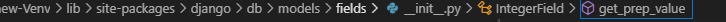
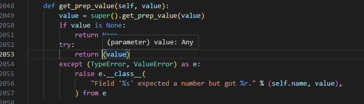
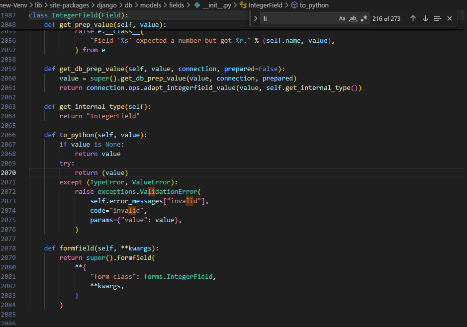

after installing all the requirements navigate to 

and make sure that this is similar to this and does not return int

this is to ensure that admin panel works

also change in this file to this

to work make  sure that ws works